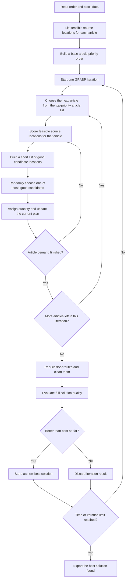

# GRASP Algorithm: Step-by-Step Explanation

This document explains the `GRASP` heuristic used in this project in a simple and operational way.

It is written for readers who:

- understand warehouse operations,
- are comfortable with industrial engineering thinking,
- but do not necessarily want code-level or mathematical detail.

The goal is to explain:

- what GRASP is,
- why it is useful for warehouse picking,
- how it makes decisions,
- how randomness is controlled,
- how routing is included,
- and where it is strong or limited.

## 1. What Is GRASP?

GRASP stands for:

`Greedy Randomized Adaptive Search Procedure`

In plain language, this means:

- the algorithm is not fully random,
- it is not fully deterministic either,
- it uses a greedy logic,
- but it adds controlled randomness,
- and it repeats the process many times.

So GRASP is best understood as:

> A method that builds many good candidate solutions quickly and keeps the best one.

This is very useful in warehouse problems because:

- one single greedy solution may get trapped in a mediocre pattern,
- but trying many slightly different good solutions often finds a better overall plan.

## 2. Why Is GRASP Useful in This Problem?

In this picking problem, the same article can often be supplied from several different source locations.

That creates a difficult decision:

- if we always choose the single best-looking source at each step,
- we may build a plan that looks good locally,
- but misses a better global combination.

GRASP helps because it does not commit too early to only one path.

Instead, it does this:

- identify the best-looking options,
- allow some controlled variation among them,
- build several complete solutions,
- compare them,
- and keep the strongest one.

This gives a good balance between:

- speed,
- stability,
- and solution quality.

## 3. What Does This GRASP Version Try to Optimize?

This implementation does not focus only on travel distance.

It tries to build a balanced plan by considering:

1. Total walking distance
2. Number of THMs opened
3. Number of floors visited

So every choice is judged not just by closeness, but also by whether it:

- opens extra THMs,
- activates extra floors,
- or stretches the route.

That is why this GRASP is much closer to the real operational objective than a simple nearest-location rule.

## 4. The Main Idea in One Sentence

The algorithm repeatedly builds a complete picking plan by making mostly good but slightly varied decisions, then keeps the best complete plan it finds.

## 5. High-Level Structure

This GRASP solver works in repeated full iterations.

Each iteration does three things:

1. Construct a feasible picking plan
2. Rebuild and clean the routes
3. Compare the result with the best solution found so far

Then the algorithm starts another iteration with a slightly different set of choices.

## 6. Flowchart



## 7. Step 1: Prepare the Candidate Space

Before the search starts, the algorithm reads:

- the order data,
- the stock data,
- and all feasible source locations for each demanded article.

It also prepares a base priority order for articles.

This base order is important because GRASP is not random chaos.

It begins from a structured view of which articles are harder or more critical.

## 8. Step 2: Build a Base Article Priority

The algorithm first creates a priority list of articles.

This list favors articles that are more difficult or more risky to postpone.

Typical reasons an article gets higher priority are:

- it has fewer source alternatives,
- it appears on fewer floors,
- its best source is much better than its second-best source,
- or its flexibility is low.

This gives GRASP a strong operational backbone.

So even though the algorithm later introduces randomness, it does not randomize from a bad starting structure.

It randomizes only around good priorities.

## 9. Step 3: Run Many Construction Iterations

Once the base priority list is ready, GRASP starts its multi-start loop.

Each iteration builds one complete feasible plan.

The first iteration is special in this implementation:

- it is deterministic,
- and acts like an elite starting solution.

That means the solver always begins with one strong baseline plan.

After that, the next iterations add controlled randomness.

This is a useful design because:

- the search is never worse than having at least one strong baseline,
- but it still explores alternative solution patterns.

## 10. Step 4: Choose the Next Article

Within one iteration, the algorithm does not always take the exact next article in a fully fixed order.

Instead, it looks at the top part of the article priority list and chooses one article from that short list.

This is called an article candidate list.

In plain language:

- the algorithm does not choose from all remaining articles,
- it chooses from a small set of the most promising next articles.

This keeps the search focused and avoids low-quality random behavior.

So the choice is:

- not fully fixed,
- but also not wild.

It is controlled exploration.

## 11. Step 5: Score Source Locations for That Article

Once an article is selected, the algorithm evaluates all feasible source locations for that article.

Each candidate location is judged by its current operational impact.

The evaluation considers:

- how much extra route burden it creates,
- whether it opens a new THM,
- whether it opens a new floor,
- and how much quantity it can cover.

This is important because the best source is not always the nearest source.

Sometimes a location looks physically close but is still a bad operational choice because:

- it opens an unnecessary THM,
- forces a new floor,
- or does not fit naturally into the current route.

## 12. Step 6: Build a Restricted Candidate List

This is the heart of GRASP.

After scoring the locations, the algorithm sorts them from best to worst.

Then it does not automatically take the single best one.

Instead, it builds a short list of good candidates.

This short list is called the:

`Restricted Candidate List`, or `RCL`

The idea is simple:

- only good candidates are allowed,
- but more than one good candidate may be considered,
- so the algorithm can explore alternative paths.

This is how GRASP combines quality and diversity.

## 13. Step 7: Randomly Choose from Good Candidates

Once the restricted candidate list is built, the algorithm chooses one of those good options.

This is not uniform randomness.

Better-ranked options are still favored more strongly.

So the algorithm behaves like this:

- the best candidate is most likely,
- the second-best candidate is still possible,
- the third-best candidate may also be possible,
- but poor candidates outside the list are excluded.

This is very useful in practice because:

- it preserves solution quality,
- but avoids the rigidity of always making the exact same choice.

## 14. Step 8: Assign Quantity and Update the Plan

After choosing a location, the algorithm assigns as much quantity as possible from that source.

Then it updates the live plan state:

- remaining stock,
- remaining article demand,
- active THMs,
- active floors,
- active nodes,
- and the current route estimate.

This makes the process adaptive.

Every new allocation changes the context for the next decision.

So the next location is always judged under the updated plan, not the original one.

## 15. Step 9: Repeat Until the Iteration Produces a Full Plan

The algorithm keeps repeating:

- choose the next article,
- score source locations,
- build the restricted candidate list,
- choose one good candidate,
- assign quantity,
- update the plan.

This continues until all demand is fully covered.

At that moment, one full feasible picking plan has been constructed.

## 16. Step 10: Rebuild and Clean the Routes

Once the allocation part of the iteration is complete, the algorithm rebuilds floor routes more carefully.

This is done in two stages:

### 16.1 Regret-style route insertion

The selected nodes are arranged into a route using a constructive logic that gives priority to nodes whose best route position is clearly better than their second-best route position.

That helps place "hard-to-fit" nodes early.

### 16.2 2-opt cleanup

After the route is built, a simple route-improvement pass is applied.

This step removes avoidable inefficiencies by checking whether route segments should be reversed.

So the final route is not just the raw construction order.

It is a cleaned-up route built from the selected nodes.

## 17. Step 11: Compare with the Best Solution Found So Far

At the end of the iteration, the algorithm measures the quality of the full plan.

Then it compares that plan against the best plan found in previous iterations.

If the new plan is better, it becomes the new best solution.

If not, it is discarded.

This is a very important point:

GRASP does not try to merge all iterations.

Each iteration is a complete independent solution attempt.

The algorithm simply keeps the best finished plan.

## 18. Why Multi-Start Matters

The multi-start structure is what gives GRASP its real strength.

A single greedy run may get trapped by one early choice.

But if the algorithm builds many good plans with slight variation, then:

- one run may discover a better THM pattern,
- another run may find a better floor combination,
- another may reduce walking distance,
- and the best of them all can be selected.

This is why GRASP often performs better than a single deterministic constructive heuristic.

## 19. What Makes This Version Practical?

This implementation is especially practical because:

### 19.1 It starts from a strong baseline

The first iteration is deterministic and acts like an elite seed.

So the solver does not depend entirely on luck.

### 19.2 It randomizes only among good choices

Randomness is introduced through restricted candidate lists, not through uncontrolled exploration.

That means solution quality remains stable.

### 19.3 It keeps iteration times short

The design tries to keep one iteration reasonably cheap.

This allows the user to improve quality simply by giving:

- more iterations,
- or more time.

## 20. How the Main Controls Work

Even without technical notation, it is helpful to understand three practical controls.

### 20.1 Iteration count

This determines how many complete solution attempts are allowed.

More iterations mean:

- more exploration,
- higher chance of improvement,
- but longer runtime.

### 20.2 Time limit

This determines how long the multi-start loop is allowed to continue.

If time runs out, the algorithm stops and returns the best solution already found.

### 20.3 RCL width

The width of the restricted candidate list controls how much randomness is allowed.

If the list is too narrow:

- the algorithm behaves almost like a deterministic greedy method.

If the list is too wide:

- solution quality may become unstable.

The practical goal is to allow some diversity without allowing poor choices.

## 21. Simple Example

Suppose one article has five feasible source locations.

After scoring them, the ranking is roughly:

1. Very good
2. Also very good
3. Good enough
4. Clearly weaker
5. Poor

GRASP may build a candidate list containing only the first three.

Then it will choose one of those three, with the better-ranked ones more likely.

This means:

- it still makes sensible choices,
- but it does not always lock into the same path.

On the next iteration, it may choose a different good option and produce a better global plan.

## 22. Strengths

- Fast enough for large practical instances
- Produces better diversity than a single deterministic greedy method
- Usually stronger than one-shot construction heuristics
- Easy to improve further by giving more time or more iterations
- Naturally suited for warehouse problems with many alternative source locations
- Gives a strong balance between solution quality and runtime

## 23. Limitations

GRASP is still a heuristic, so it does not guarantee the true optimum.

Its main limits are:

- it may need several iterations before a strong combination appears,
- if iteration time is too long, the number of completed starts can stay low,
- if randomness is too strong, quality may become unstable,
- and if randomness is too weak, the method may behave too much like a plain greedy approach.

So GRASP works best when its exploration level is controlled carefully.

## 24. Best Use Cases

This algorithm is most useful when:

- exact optimization is too slow,
- a single greedy method feels too rigid,
- there are many alternative source combinations,
- and the user wants a practical quality-versus-time tradeoff.

It is especially valuable when:

- you want a better standalone heuristic,
- or you want a good solution pool that can later feed stronger local search methods.

## 25. Plain-Language Pseudocode

```text
1. Read demand and stock data.
2. Build a base priority order for articles.
3. Start the first iteration with a deterministic strong baseline.
4. For each next iteration:
   - choose the next article from the top part of the priority list,
   - score feasible source locations for that article,
   - build a short list of good location options,
   - choose one good option with controlled randomness,
   - assign quantity and update the plan,
   - continue until all demand is covered.
5. Rebuild and clean the routes.
6. Compare the completed plan against the best-so-far solution.
7. Keep the better one.
8. Stop when the time limit or iteration limit is reached.
9. Return the best complete solution found.
```

## 26. One-Sentence Summary

GRASP is a multi-start heuristic that repeatedly builds complete picking plans by choosing among good candidate articles and source locations with controlled randomness, then returns the best finished plan it finds.

## 27. Related Implementation Files

For readers who later want to connect this explanation to the code:

- Main solver: `grasp_heuristic.py`
- Shared scoring and route logic: `heuristic_common.py`

