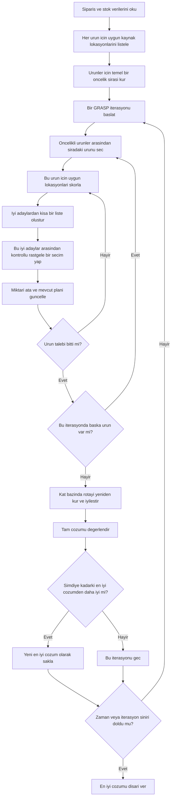

# GRASP Algoritmasi: Adim Adim Aciklama

Bu dokuman, projedeki `GRASP` yaklasimini sade ve operasyon odakli bir dille anlatir.

Hedef kitle:

- depo operasyonlarini bilen,
- endustri muhendisligi bakis acisina sahip olan,
- ama koda ve teknik ayrintilara cok hakim olmayan kisiler.

Bu nedenle burada:

- formul kullanimi sinirli tutulmustur,
- degisken isimlerinden kacilmistir,
- aciklama daha cok karar mantigi uzerinden kurulmustur.

Amac su sorulari cevaplamaktir:

- GRASP nedir,
- neden bu problem icin uygundur,
- nasil karar verir,
- rastgelelik nasil kontrol edilir,
- rota etkisi nasil dikkate alinir,
- guclu ve zayif yanlari nelerdir.

## 1. GRASP Nedir?

GRASP su ifadenin kisaltmasidir:

`Greedy Randomized Adaptive Search Procedure`

Sade bir dille bu su anlama gelir:

- algoritma tamamen rastgele degildir,
- tamamen deterministik de degildir,
- acgozlu karar mantigi kullanir,
- ama kontrollu rastgelelik ekler,
- ve bunu birden fazla kez tekrarlar.

En basit ozetle:

> GRASP, birden fazla iyi aday cozum olusturup bunlar arasindan en iyisini secen bir yontemdir.

Bu yapi depo toplama problemlerinde cok faydalidir.

Cunku tek bir acgozlu cozum:

- hizli olabilir,
- ama erken bir yanlis secime kilitlenebilir.

GRASP ise:

- tek bir yola mahkum kalmaz,
- farkli iyi kombinasyonlari dener,
- ve sonunda en iyi tam cozumu saklar.

## 2. Bu Problemde Neden Faydalidir?

Bu problemde ayni urun birden fazla lokasyondan toplanabiliyor.

Dolayisiyla sunun cevabi onemli:

> Simdi hangi lokasyonu secersem tum plan daha iyi olur?

Buradaki zorluk sudur:

- o an cok iyi gorunen bir secim,
- daha sonra tum plani kisitlayabilir.

Yani sadece "su anki en iyi secim" yetmez.

Ayni zamanda:

- farkli iyi secim kombinasyonlarini denemek de gerekir.

GRASP bunu saglar.

Tek bir plan kurmak yerine:

- birden fazla iyi plan kurar,
- her birinde kontrollu farklilik yaratir,
- sonra en iyi sonucu secer.

## 3. Bu GRASP Versiyonu Neyi Optimize Etmeye Calisiyor?

Bu projedeki GRASP sadece yuruyus mesafesine bakmaz.

Ayni anda sunlari dengelemeye calisir:

1. Toplam yuruyus mesafesi
2. Acilan THM sayisi
3. Kullanilan kat sayisi

Yani bir lokasyon secildiginde algoritma sunu dusunur:

- rota ne kadar buyuyor,
- yeni THM aciliyor mu,
- yeni kata cikiliyor mu.

Bu nedenle bu GRASP, basit en yakin lokasyon kuralindan cok daha gercekci bir operasyonel bakis sunar.

## 4. Ana Fikir Tek Cumlede Nedir?

GRASP, iyi gorunen kararlar arasinda kontrollu cesitlilik yaratarak birden fazla tam toplama plani kurar ve en iyi tam plani secip geri verir.

## 5. Buyuk Resimde Nasil Calisir?

GRASP birden fazla iterasyonla calisir.

Her iterasyonda uc temel is yapar:

1. Gecerli bir toplama plani kurar
2. Rotalari yeniden olusturur ve temizler
3. Elde edilen sonucu o ana kadarki en iyi cozumle karsilastirir

Sonra yeni bir iterasyona gecer.

Yani her iterasyon ayri bir cozum denemesidir.

## 6. Akis Semasi



## 7. Adim 1: Uygun Secenekleri Hazirlamak

Algoritma once sunlari hazirlar:

- siparisteki urunler,
- her urun icin kullanilabilecek lokasyonlar,
- bu lokasyonlardaki stoklar,
- ilgili THM bilgileri,
- kat bilgileri,
- fiziksel toplama noktasi bilgileri.

Bu asamada algoritma henuz cozum kurmaz.

Sadece karar verilecek secenekleri masaya koyar.

## 8. Adim 2: Urunler Icin Temel Oncelik Sirasi Kurmak

GRASP tamamen rastgele baslamaz.

Once urunler icin temel bir oncelik sirasi olusturur.

Bu siralama genellikle sunlari one cikarir:

- az alternatifli urunler,
- az kat secenegi olan urunler,
- esnekligi dusuk urunler,
- en iyi secenegi ile ikinci en iyi secenegi arasinda buyuk fark olan urunler.

Bu cok onemlidir.

Cunku GRASP rastgeleligin icine iyi bir yapi yerlestirir.

Yani rastgelelik kotu secenekler arasinda degil, zaten iyi gorunen secenekler arasinda calisir.

## 9. Adim 3: Coklu Baslatma Yapisi

Temel oncelik listesi hazir olduktan sonra GRASP iterasyonlara baslar.

Her iterasyon tam bir cozum denemesidir.

Bu implementasyonda ilk iterasyon ozel bir rol oynar:

- ilk iterasyon deterministiktir,
- guclu bir baslangic cozum olarak kullanilir.

Bu "elite seed" mantigidir.

Bunun faydasi sunlardir:

- algoritma en azindan bir tane guclu temel cozum uretir,
- sonraki iterasyonlarda ise farkli cozum bolgeleri aranir.

Boylece hem saglamlik hem cesitlilik saglanir.

## 10. Adim 4: Siradaki Urunu Secmek

Bir iterasyon icinde algoritma her zaman tek bir sabit sirayi takip etmez.

Bunun yerine, oncelik listesinin ust tarafindaki urunler arasindan secim yapar.

Yani:

- tum kalan urunler arasindan secmez,
- sadece en uygun gorunen ust grup icinden secim yapar.

Bu yaklasim su dengeyi kurar:

- tam deterministik olmaz,
- ama kaliteyi de bozacak kadar serbest olmaz.

Boylece iyi urunler arasinda kontrollu cesitlilik saglanir.

## 11. Adim 5: O Urun Icin Lokasyonlari Skorlamak

Bir urun secildikten sonra algoritma o urun icin uygun lokasyonlari degerlendirir.

Her lokasyon icin su etkiler dusunulur:

- mevcut rotaya ne kadar yuk bindiriyor,
- yeni THM aciyor mu,
- yeni kat aciyor mu,
- ne kadar miktar karsiliyor.

Bu nedenle algoritma sadece "en yakin lokasyon" secmez.

Sunu dusunur:

> Bu lokasyon mevcut plan icine operasyonel olarak ne kadar iyi oturuyor?

Bu, GRASP'in kalitesini belirleyen en kritik noktalardan biridir.

## 12. Adim 6: Restricted Candidate List Olusturmak

Bu kisim GRASP'in kalbidir.

Butun lokasyonlar skorlandiktan sonra algoritma onlari en iyiden daha zayifa dogru siralar.

Fakat dogrudan birinciyi almaz.

Bunun yerine iyi adaylardan kisa bir liste olusturur.

Bu listeye denir:

`Restricted Candidate List`, kisaca `RCL`

Mantik sudur:

- sadece iyi gorunen adaylar listeye girebilir,
- ama birden fazla iyi aday ayni anda oyunda kalabilir,
- boylece farkli cozum yollarini denemek mumkun olur.

Bu yapi kalite ve cesitliligi ayni anda saglar.

## 13. Adim 7: Iyi Adaylar Arasindan Kontrollu Rastgele Secim Yapmak

RCL hazirlandiktan sonra algoritma listedeki adaylardan birini secer.

Bu secim tamamen esit olasilikli degildir.

Daha iyi siralanan adaylar yine daha avantajlidir.

Yani davranis su sekildedir:

- en iyi aday en guclu secenektir,
- ikinci ve ucuncu aday da zaman zaman secilebilir,
- ama zayif adaylar liste disinda birakilir.

Bu cok degerlidir.

Cunku:

- cozum kalitesi korunur,
- ama algoritma her seferinde ayni yolu izlemez.

## 14. Adim 8: Miktari Atamak ve Plani Guncellemek

Secim yapildiktan sonra algoritma o lokasyondan mumkun oldugu kadar miktar atar.

Ardindan plani gunceller:

- kalan stok,
- kalan urun ihtiyaci,
- aktif THM'ler,
- aktif katlar,
- aktif fiziksel toplama noktalar,
- mevcut rota tahmini.

Bu adaptif davranisin temelidir.

Her yeni secim sonraki secimin kosullarini degistirir.

Dolayisiyla algoritma her adimda guncel plan uzerinden karar verir.

## 15. Adim 9: Tum Talep Bitene Kadar Devam Etmek

Algoritma ayni donguyu surdurur:

- urun sec,
- lokasyonlari skorla,
- RCL kur,
- kontrollu secim yap,
- miktari ata,
- plani guncelle.

Bu surec tum urunlerin talebi tamamen karsilanana kadar devam eder.

Bu noktada bir iterasyonun tam cozum denemesi tamamlanmis olur.

## 16. Adim 10: Rotalari Yeniden Kurmak ve Temizlemek

Allocation bittikten sonra algoritma kat bazinda rotalari daha duzgun bicimde yeniden kurar.

Bu asamada iki ana fikir kullanilir.

### 16.1 Regret insertion

Secilmis noktalar, rotaya eklenecekleri en uygun yerlere gore yerlesirilir.

Ozellikle sunun gibi dusunulur:

> Bu noktayi simdi en uygun yerine koymazsam, sonra cok daha kotu bir yere mi koymak zorunda kalirim?

Bu sayede rotaya zor oturan noktalar daha erken ve daha akillica yerlestirilir.

### 16.2 2-opt temizligi

Rota ilk haliyle kurulduktan sonra gereksiz dolasiliklar azaltilmaya calisilir.

Bunun icin rota parcaciklari kontrol edilir ve gerekiyorsa ters cevrilerek daha temiz bir tur elde edilir.

Yani iterasyon sonunda elde edilen rota:

- sadece secim sirasinin kopyasi degildir,
- sonradan iyilestirilmis bir rotadir.

## 17. Adim 11: En Iyi Cozumle Karsilastirmak

Her iterasyonun sonunda ortaya cikmis olan tam planin kalitesi hesaplanir.

Ardindan bu plan, simdiye kadar bulunan en iyi plan ile karsilastirilir.

Eger daha iyiyse:

- yeni en iyi cozum olarak saklanir.

Daha iyi degilse:

- o iterasyon sadece bir deneme olarak kalir.

Burada onemli nokta sunlardir:

- iterasyonlar birbirinden bagimsizdir,
- her iterasyon tam bir cozum uretir,
- ve sonunda sadece en iyi tam cozum tutulur.

## 18. Multi-Start Yapisi Neden Onemli?

GRASP'in asil gucu buradan gelir.

Tek bir greedy calistirma:

- erken bir secime mahkum olabilir,
- ve o secim tum planin yonunu belirleyebilir.

Ama GRASP birden fazla iyi cozum kurdugu icin:

- bir iterasyon daha iyi THM kullanimi bulabilir,
- bir iterasyon daha iyi kat dengesi bulabilir,
- bir iterasyon daha iyi rota uretebilir.

En iyi olan da sonunda secilir.

Bu nedenle GRASP, tek bir deterministik yontemden genellikle daha guclu olur.

## 19. Bu Implementasyonu Pratik Yapan Nedir?

Bu implementasyon ozellikle pratiktir cunku:

### 19.1 Guclu bir baslangicla baslar

Ilk iterasyon deterministik elite seed olarak calisir.

Yani algoritma tamamen sansa birakilmaz.

### 19.2 Rastgelelik yalnizca iyi secenekler icinde kullanilir

Rastgelelik kotu secenekler arasinda dolasmak icin degil, iyi secenekler arasinda farkli yollar denemek icin kullanilir.

### 19.3 Iterasyonlar nispeten kisa tutulur

Bu sayede kaliteyi artirmanin dogal yolu sunlar olur:

- daha fazla iterasyon vermek,
- ya da daha uzun sure tanimak.

## 20. Ana Kontroller Ne Is Yapar?

Teknik detaya girmeden uc pratik kontrolu anlamak faydalidir.

### 20.1 Iterasyon sayisi

Kac tam cozum denemesi yapilacagini belirler.

Daha fazla iterasyon:

- daha fazla arama cesitliligi,
- ama daha uzun calisma suresi demektir.

### 20.2 Zaman limiti

Algoritmanin aramayi ne kadar sure devam ettirebilecegini belirler.

Sure doldugunda, o ana kadar bulunan en iyi cozum dondurulur.

### 20.3 RCL genisligi

RCL ne kadar genis olursa, rastgelelik o kadar artar.

Cok dar olursa:

- algoritma neredeyse deterministik hale gelir.

Cok genis olursa:

- kalite dengesizlesebilir.

Iyi ayar, kaliteyi korurken yeterli cesitlilik saglayan ayardir.

## 21. Basit Bir Ornek

Bir urun icin bes aday lokasyon oldugunu dusunelim.

Skorlama sonunda tablo kabaca soyle olsun:

1. Cok iyi
2. Yine cok iyi
3. Yeterince iyi
4. Belirgin bicimde daha zayif
5. Zayif

GRASP burada ilk ucu RCL icine alabilir.

Sonra:

- bazen birinciyi,
- bazen ikinciyi,
- bazen ucuncuyu

secebilir.

Ama dorduncu ve besinci secenekleri oyuna sokmaz.

Boylece:

- kalite korunur,
- ama farkli iyi cozum yollarina da izin verilir.

## 22. Guclu Yanlari

- Buyuk problemlerde pratik hiz sunar
- Tek bir deterministik yontemden daha fazla cesitlilik uretir
- Tek atimli kurucu sezgisellere gore genelde daha gucludur
- Daha fazla sure veya iterasyon verilerek kalite artirilabilir
- Alternatif kaynak lokasyonlari bol olan depo problemleri icin uygundur
- Kalite ve sure arasinda iyi bir denge kurar

## 23. Sinirlari

GRASP yine de bir sezgiseldir, yani optimumu garanti etmez.

Temel sinirlari sunlardir:

- iyi bir kombinasyon bazen birkac iterasyondan sonra ortaya cikabilir,
- tek iterasyon suresi uzarsa tamamlanan baslangic sayisi azalabilir,
- rastgelelik fazla olursa kalite oynak hale gelebilir,
- rastgelelik az olursa yontem plain greedy'ye cok benzeyebilir.

Bu nedenle GRASP en iyi sonucu, cesitliligin kontrollu tutuldugu durumda verir.

## 24. En Uygun Kullanim Alanlari

Bu algoritma ozellikle su durumlarda cok uygundur:

- exact model cok yavas kaliyor ise,
- tek bir greedy cozum fazla katiyse,
- alternatif lokasyon kombinasyonlari coksa,
- ve kalite ile sure arasinda pratik bir denge isteniyorsa.

Ayrica su rollerde cok faydalidir:

- tek basina kullanilan guclu bir heuristic olarak,
- ya da daha sonra VNS, LNS, ALNS gibi yontemlere verilecek guclu cozum havuzu olusturmak icin.

## 25. Sade Pseudocode

```text
1. Talep ve stok verilerini oku.
2. Urunler icin temel bir oncelik sirasi kur.
3. Ilk iterasyonda guclu bir deterministik baslangic cozum olustur.
4. Sonraki iterasyonlarda:
   - oncelik listesinin ust tarafindan bir urun sec,
   - o urun icin lokasyonlari skorla,
   - iyi adaylardan kisa bir liste kur,
   - bu iyi adaylar arasindan kontrollu rastgele bir secim yap,
   - miktari ata ve plani guncelle,
   - tum talep bitene kadar devam et.
5. Kat bazinda rotalari yeniden kur ve temizle.
6. Elde edilen cozumu simdiye kadarki en iyi cozumle karsilastir.
7. Daha iyiyse sakla.
8. Zaman ya da iterasyon siniri dolunca en iyi cozumu dondur.
```

## 26. Tek Cumlede Ozet

GRASP, iyi gorunen urun ve lokasyon secenekleri arasinda kontrollu cesitlilik yaratarak birden fazla tam toplama plani kuran ve sonunda en iyi tam plani secen coklu-baslatmali bir sezgiseldir.

## 27. Koda Gecmek Isterse

Bu aciklamayi daha sonra kodla eslestirmek isterseniz bakilacak temel dosyalar sunlardir:

- `grasp_heuristic.py`
- `heuristic_common.py`

