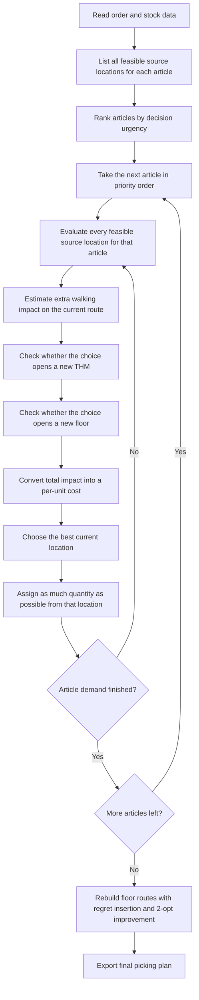

# Route-Aware Regret Algorithm: Step-by-Step Explanation

This document explains the `route-aware regret` heuristic in a simple and practical way.

It is written for readers who are comfortable with warehouse operations, picking logic, and industrial engineering thinking, but who do not necessarily want to read the code or mathematical notation.

The goal is to explain:

- what this algorithm is,
- why it is useful,
- how it makes decisions,
- how routing affects those decisions,
- and where its strengths and limits are.

## 1. What Is This Algorithm?

The route-aware regret algorithm is a fast decision-making method for warehouse picking.

Its job is to answer this question:

> If the same article can be picked from several different locations, which location should we choose so that the overall picking plan becomes better?

Here, "better" does not mean only shorter walking distance.

The algorithm also considers:

- whether a new THM has to be opened,
- whether a new floor has to be visited,
- whether the current route becomes harder or longer,
- and how much quantity can be picked from that location.

So this is not a simple nearest-location rule.

It is a more operationally aware heuristic that tries to build a good plan quickly by balancing:

- travel effort,
- THM usage,
- floor usage,
- and allocation flexibility.

## 2. Why Is It Called "Regret"?

The word "regret" means "future penalty if I do not choose the good option now."

In warehouse terms, imagine this:

- One article has only one really convenient source.
- The other available sources are much worse.

If you postpone that article and use the easy source badly, you may later be forced to pick from a much more expensive location.

That future penalty is the idea behind regret.

So the algorithm gives priority to articles where:

- there are few good choices,
- the best choice is clearly better than the second-best choice,
- and delaying the decision may create a worse outcome later.

In short:

> Regret helps the algorithm recognize which decisions are too risky to postpone.

## 3. Why Is It "Route-Aware"?

Many simple allocation heuristics look only at location-level properties such as:

- stock amount,
- floor,
- aisle,
- or direct closeness to the depot.

This algorithm goes one step further.

When it evaluates a candidate location, it asks:

> If I add this location to the current picking plan, how much will the route really grow?

That is the route-aware part.

So instead of thinking:

- "This location looks close on its own,"

it thinks:

- "Given the locations I have already selected, does adding this one fit naturally into the route, or does it stretch the route badly?"

This is a major difference, because in warehouses the true cost of a pick depends on the whole route, not only on one location by itself.

## 4. What Is the Main Objective?

The algorithm tries to keep the overall picking plan cheap according to three business effects:

1. Walking distance
2. Number of THMs opened
3. Number of floors visited

So every location is judged by how much it increases those three things.

This is important because the best operational decision is not always:

- the shortest path,
- or the fewest THMs,
- or the fewest floors.

Usually the real target is a balance between all three.

## 5. High-Level Logic

At a high level, the algorithm works in two layers:

1. It decides which article to handle first.
2. For that article, it decides which location should supply the next quantity.

After all allocation decisions are finished, it rebuilds the route more carefully floor by floor.

## 6. Flowchart



## 7. Step 1: Prepare the Decision Space

Before making any decisions, the algorithm organizes the data.

It identifies:

- each demanded article,
- all stock locations that can serve that article,
- how much stock each location has,
- which THM each location belongs to,
- which floor it is on,
- and which physical picking node it belongs to.

At this stage, no route is fixed yet.

The algorithm is only building the list of available choices.

## 8. Step 2: Rank Articles by Urgency

The algorithm does not start with a random article.

It first asks:

> Which article is more dangerous to postpone?

Articles move to the front of the queue when they show signs such as:

- few alternative source locations,
- few floor alternatives,
- low stock flexibility,
- or a large quality gap between the best and second-best source.

This is the "regret-style" priority rule.

The purpose is simple:

- easy articles can wait,
- risky articles should be decided earlier.

This is often a good idea in industrial settings because flexibility is a resource.

When flexibility is low, bad decisions become expensive very quickly.

## 9. Step 3: Evaluate Candidate Locations for the Current Article

Once the next article is selected, the algorithm examines all feasible source locations for that article.

For each candidate location, it asks four practical questions.

### 9.1 Does it add walking distance?

The algorithm estimates how much extra route length this location would create if added to the current floor route.

It does not simply use geometric closeness.

Instead, it checks how naturally the new node can be inserted into the existing route.

If the node fits smoothly between already selected locations, the extra cost may be small.

If the node forces a detour, the extra cost may be large.

### 9.2 Does it open a new THM?

If the location belongs to a THM that is already in use, there is no new THM opening penalty.

If it requires opening a THM that is not yet in the plan, the location becomes more expensive.

This reflects the operational idea that it is often better to consolidate picks into already used THMs when possible.

### 9.3 Does it open a new floor?

If the location is on a floor that is already active, there is no new floor opening penalty.

If selecting it forces the plan to visit a new floor, that candidate becomes more expensive.

This reflects the reality that cross-floor activity has coordination cost, movement cost, and complexity cost.

### 9.4 How much quantity can it cover?

The algorithm also checks how much of the remaining demand can be satisfied from that location.

This matters because:

- a location that adds some cost but covers a large amount may still be a good choice,
- while a location that creates the same cost for only a very small amount may be inefficient.

So the algorithm judges locations on a "cost per picked unit" basis.

## 10. Step 4: Choose the Best Current Location

After evaluating all candidate locations, the algorithm chooses the one with the best current unit cost.

In plain language, it chooses the location that gives the cheapest mix of:

- route growth,
- THM impact,
- floor impact,
- and covered quantity.

This is a greedy decision, but not a naive greedy decision.

It is greedy in the sense that it chooses the best option available right now.

But it is still smarter than a basic greedy rule because:

- the article order was already shaped by regret,
- and the location score is route-aware instead of location-only.

## 11. Step 5: Assign Quantity and Update the State

After selecting the best location, the algorithm commits part or all of the remaining demand.

Then it updates the live state of the plan:

- remaining stock at that location,
- selected quantity by location,
- selected quantity by article,
- active THMs,
- active floors,
- active nodes on each floor,
- and the current estimated route on each floor.

This update is important because the next decision should not be made on stale information.

Every new pick changes the context for the next pick.

That is why the algorithm is adaptive during construction.

## 12. Step 6: Repeat Until the Article Is Fully Covered

Some articles are supplied from a single location.

Others need to be split across several locations because:

- one source does not have enough stock,
- or the best location should not carry the whole demand.

So the algorithm repeats the same evaluation process until the current article's demand is fully satisfied.

Only then does it move to the next article in the priority queue.

## 13. Step 7: Rebuild Routes After Allocation

During construction, the algorithm keeps an incremental estimate of each floor route.

That helps it make fast decisions.

After all picks are allocated, it then performs a cleaner route rebuild floor by floor.

This rebuild uses two ideas:

### 13.1 Regret insertion

The route is built by repeatedly choosing the node whose best insertion is much better than its second-best insertion.

This is another use of the regret idea:

- if a node has only one really good place in the route,
- it should be inserted earlier.

### 13.2 2-opt improvement

After the route is constructed, the algorithm performs a simple route cleanup step.

It checks whether reversing parts of the route can remove unnecessary crossing or inefficiency.

This is a standard and practical route improvement technique.

So the final route is not just the construction order.

It is a cleaned-up route derived from the selected nodes.

## 14. Why This Algorithm Works Well in Practice

This algorithm works well because it combines three useful ideas:

### 14.1 It protects critical decisions

By prioritizing hard-to-serve articles early, it avoids wasting the few good options those articles may have.

### 14.2 It prices operational side effects directly

It does not treat all source locations equally.

It explicitly accounts for:

- route growth,
- THM opening,
- and floor opening.

That makes it much closer to the real business objective.

### 14.3 It stays fast

It does not try to solve the full problem exactly.

Instead, it builds a good solution quickly with a sequence of informed local decisions.

That makes it practical for large instances where an exact model may be too slow.

## 15. Simple Example

Suppose one article can be picked from three possible places:

- Location A is on an already active floor and already active THM, and fits well into the current route.
- Location B is slightly closer in pure geometry, but it opens a new THM.
- Location C has enough stock, but it is on a new floor.

A simple nearest-location rule might choose B.

But route-aware regret may choose A because:

- it avoids a new THM opening,
- it avoids route disruption,
- and it still serves the demand efficiently.

This is exactly the kind of practical tradeoff the algorithm is designed to capture.

## 16. Strengths

- Fast enough for large operational instances
- Considers distance, THM count, and floor count together
- Better aligned with real picking cost than a simple nearest-source rule
- Deterministic and reproducible
- Good as both a standalone heuristic and a seed for stronger local search methods

## 17. Limitations

It is still a heuristic, so it does not guarantee the true optimum.

Its main limitations are:

- it makes decisions step by step, so early choices still matter,
- it may miss a better global combination that requires a short-term sacrifice,
- and by itself it is weaker than a full improvement framework such as VNS, LNS, or ALNS.

So it is best viewed as:

- a strong fast constructive method,
- not the final word in search.

## 18. Best Use Case

This algorithm is most useful when you want:

- a fast and reliable baseline,
- a plan that respects operational structure,
- and a construction method that already "understands" route impact.

It is especially valuable as:

- a direct production heuristic when speed matters,
- or a high-quality starting solution for neighborhood-search algorithms.

## 19. Plain-Language Pseudocode

```text
1. Read demand and stock data.
2. List feasible source locations for each article.
3. Rank articles by urgency:
   - fewer alternatives,
   - less flexibility,
   - larger penalty if the best choice is missed.
4. For the next article:
   - evaluate every feasible source location,
   - estimate added route burden,
   - check THM opening impact,
   - check floor opening impact,
   - convert the result into a per-unit cost.
5. Choose the best current location.
6. Assign as much quantity as possible.
7. Repeat until the article is fully covered.
8. Continue until all articles are covered.
9. Rebuild and clean floor routes.
10. Export the final plan.
```

## 20. One-Sentence Summary

The route-aware regret algorithm is a fast warehouse-picking heuristic that gives early priority to risky allocation decisions and chooses source locations based on their real impact on route growth, THM usage, and floor usage.

## 21. Related Implementation Files

For readers who later want to connect this explanation to the code:

- Main solver: `regret_based_heuristic.py`
- Shared scoring and route logic: `heuristic_common.py`

