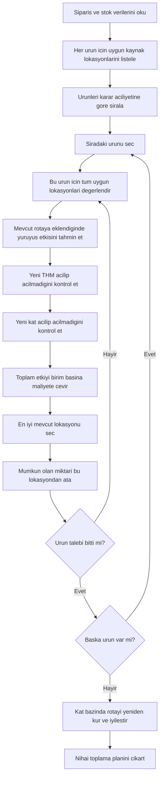

# Route-Aware Regret Algoritmasi: Adim Adim Aciklama

Bu dokuman, `route-aware regret` sezgisini sade, acik ve operasyon odakli bir dille anlatir.

Hedef kitle:

- depo operasyonlarini bilen,
- endustri muhendisligi bakis acisina sahip olan,
- ama koda ya da teknik formulasyonlara cok hakim olmayan kisiler.

Bu nedenle burada:

- degisken isimleri,
- matematiksel notasyon,
- kod ayrintilari

olabildigince kullanilmamistir.

Dokumanin amaci sudur:

- bu algoritma nedir,
- neden kullanilir,
- kararlarini nasil verir,
- rota etkisini nasil hesaba katar,
- guclu ve zayif yanlari nelerdir,
- bunu adim adim ve kolay takip edilir sekilde anlatmak.

## 1. Bu Algoritma Nedir?

Route-aware regret algoritmasi, depo toplama problemi icin gelistirilmis hizli bir karar verme yaklasimidir.

Temel sorusu sudur:

> Ayni urun birden fazla lokasyondan toplanabiliyorsa, hangi lokasyonu secersek toplam plan daha iyi olur?

Buradaki "daha iyi" ifadesi sadece daha kisa yuruyus anlamina gelmez.

Algoritma ayni anda sunlari da dikkate alir:

- yeni bir THM aciliyor mu,
- yeni bir kata cikiliyor mu,
- mevcut rota ne kadar bozuluyor ya da uzuyor,
- secilen lokasyon ne kadar miktar karsilayabiliyor.

Yani bu algoritma:

- sadece en yakin lokasyonu secen basit bir kural degildir,
- operasyonel etkileri birlikte dusunen daha akilli bir sezgiseldir.

## 2. Neden "Regret" Deniyor?

Regret kelimesi burada su anlama gelir:

> Bugun iyi bir secenegi kullanmazsam, yarin daha kotu bir secenege mecbur kalir miyim?

Basit bir ornek dusunelim:

- Bir urunun bir tane cok iyi lokasyonu var.
- Diger alternatifleri ise belirgin bicimde daha kotu.

Bu durumda o urunu geciktirmek risklidir.

Cunku iyi secenegi yanlis kullanirsaniz ya da gec kalirsaniz, daha sonra ayni urunu cok daha pahali bir sekilde toplamak zorunda kalabilirsiniz.

Iste regret mantigi bunu yakalamaya calisir.

Kisaca:

- iyi secenek sayisi azsa,
- en iyi secenek ile ikinci en iyi secenek arasinda buyuk fark varsa,
- bu urunu erken ele almak mantiklidir.

## 3. Neden "Route-Aware" Deniyor?

Bir cok basit allocation sezgiseli yalnizca lokasyonun kendisine bakar.

Ornegin:

- stok miktari ne kadar,
- hangi katta,
- hangi koridorda,
- depoya ne kadar yakin.

Route-aware regret ise bir adim ileri gider.

Bir lokasyonu degerlendirirken sunu sorar:

> Bu lokasyonu mevcut plana ekledigimde rota gercekte ne kadar buyuyecek?

Bu cok onemlidir.

Cunku bir lokasyon kagit uzerinde yakin gorunse bile:

- mevcut secilmis lokasyonlara uyumlu degilse,
- rotayi gereksiz uzatiyorsa,
- ek bir sapma yaratiyorsa

operasyonel olarak iyi secenek olmayabilir.

Bu nedenle algoritma sadece "lokasyon iyi mi?" diye bakmaz.

Sunu sorar:

> Bu lokasyon mevcut toplama turunun icine ne kadar dogal yerlestirilebiliyor?

## 4. Algoritmanin Genel Hedefi Nedir?

Bu algoritma toplam plani uc ana etki acisindan dusuk maliyetli tutmaya calisir:

1. Toplam yuruyus mesafesi
2. Acilan THM sayisi
3. Kullanilan kat sayisi

Bu uc unsur depo operasyonunda dogrudan onemlidir.

Dolayisiyla bir lokasyon secildiginde algoritma sunu sorgular:

- rota ne kadar uzadi,
- yeni THM acildi mi,
- yeni kat acildi mi.

Yani bu yontem, sadece mesafeyi kisaltmaya calisan bir rota algoritmasi degildir.

Ayni zamanda operasyonel sadeligi de korumaya calisir.

## 5. Algoritmanin Buyuk Resimde Calisma Mantigi

Algoritma iki ana seviyede dusunulebilir:

1. Hangi urun once ele alinacak?
2. O urun icin hangi lokasyon secilecek?

Tum allocation kararlarindan sonra da secilen lokasyonlardan daha duzgun bir rota olusturulur.

Bu nedenle algoritma hem:

- secim yapar,
- hem de secimin rota etkisini degerlendirir.

## 6. Akis Semasi



## 7. Adim 1: Karar Alanini Hazirlamak

Algoritma once veriyi duzenler.

Sunlari belirler:

- hangi urunlerden ne kadar talep var,
- her urun icin hangi stok lokasyonlari kullanilabilir,
- bu lokasyonlarda ne kadar stok var,
- hangi lokasyon hangi THM'ye ait,
- hangi katta oldugu,
- hangi fiziksel toplama noktasina denk geldigi.

Bu asamada algoritma henuz "rota"yi kesinlestirmez.

Sadece karar verilebilecek butun secenekleri masaya koyar.

## 8. Adim 2: Urunleri Onceliklendirmek

Algoritma urunleri rastgele islemez.

Once sunu sorar:

> Hangi urunu geciktirmek daha riskli?

Asagidaki durumlara sahip urunler one cekilir:

- az sayida alternatif lokasyonu olanlar,
- az sayida kat alternatifi olanlar,
- stok esnekligi zayif olanlar,
- en iyi secenegi ile ikinci en iyi secenegi arasinda buyuk fark olanlar.

Bunun mantigi cok pratiktir:

- esnek urunler bekleyebilir,
- zor urunler erken karara baglanmalidir.

Depo operasyonunda esneklik bir kaynaktir.

Eger bir urunun iyi secenekleri azsa, o karari bastan dogru vermek gerekir.

## 9. Adim 3: Mevcut Urun Icin Tum Lokasyonlari Degerlendirmek

Sira bir urune geldiginde algoritma o urun icin tum uygun lokasyonlara bakar.

Her lokasyon icin dort temel soru sorar.

### 9.1 Bu secim rotayi ne kadar uzatacak?

Algoritma, lokasyonun tek basina yakin olup olmadigina bakmaz.

Sununla ilgilenir:

> Bu yeni nokta mevcut rota icine rahatca yerlestirilebiliyor mu, yoksa ek sapma mi yaratiyor?

Eger yeni nokta mevcut secilmis noktalarin arasina dogal sekilde girebiliyorsa ek maliyet dusuk olabilir.

Ama uzak, ters tarafta ya da rotayi bozan bir noktaysa ek maliyet yuksek olabilir.

### 9.2 Bu secim yeni bir THM aciyor mu?

Eger lokasyon zaten kullanilan bir THM icindeyse, burada ekstra THM acma cezasi yoktur.

Ama secim yeni bir THM aciyorsa, lokasyon daha maliyetli hale gelir.

Bu operasyonel olarak mantiklidir.

Cunku genelde mumkunse:

- zaten kullanilan THM'lerde kalmak,
- acilan kutu sayisini kontrol altinda tutmak istenir.

### 9.3 Bu secim yeni bir kat aciyor mu?

Eger lokasyon zaten aktif olan bir kattaysa yeni kat cezasi yoktur.

Ama secim yeni bir kata gitmeyi gerektiriyorsa, bu da ek maliyet olarak algilanir.

Bu da gercek operasyonla uyumludur.

Cunku yeni bir kata gitmek:

- hareket maliyeti yaratir,
- koordinasyon maliyeti yaratir,
- plani daha karmasik hale getirir.

### 9.4 Bu lokasyon ne kadar miktar karsiliyor?

Algoritma sadece "bu lokasyon iyi mi?" diye bakmaz.

Ayni zamanda sunu da sorar:

> Bu lokasyon ihtiyacin ne kadarini karsiliyor?

Bu onemlidir.

Cunku:

- bir miktar ek maliyet yaratip cok urun karsilayan bir lokasyon iyi olabilir,
- ama ayni maliyeti getirip cok az miktar karsilayan bir lokasyon zayif olabilir.

Bu yuzden algoritma secenekleri birim bazinda karsilastirir.

## 10. Adim 4: En Iyi Mevcut Lokasyonu Secmek

Butun adaylar degerlendirildikten sonra algoritma o an icin en iyi lokasyonu secer.

Buradaki "en iyi" su anlama gelir:

- rota etkisi makul,
- yeni THM acma etkisi makul,
- yeni kat acma etkisi makul,
- karsilanan miktara gore verimli.

Yani secim mekanizmasi acgozludur, ama saf acgozlu degildir.

Neden?

Cunku:

- urun sirasi zaten regret mantigiyla belirlenmistir,
- lokasyon skoru da rota etkisini icermektedir.

Bu nedenle karar mantigi, basit bir "en yakin lokasyonu al" kuralindan belirgin sekilde daha gucludur.

## 11. Adim 5: Miktari Atamak ve Durumu Guncellemek

Secim yapildiktan sonra algoritma o lokasyondan mumkun oldugu kadar miktar atar.

Ardindan plandaki canli durumu gunceller:

- lokasyonda kalan stok,
- secilen miktar,
- aktif THM'ler,
- aktif katlar,
- aktif fiziksel toplama noktalari,
- her kat icin mevcut rota tahmini.

Bu cok onemlidir.

Cunku bir sonraki karar artik yeni kosullara gore verilmelidir.

Yani algoritma her secimden sonra kendini gunceller.

Bu sayede adaptif sekilde calisir.

## 12. Adim 6: Urunun Talebi Bitene Kadar Tekrar Etmek

Bazi urunler tek bir lokasyondan karsilanabilir.

Bazi urunlerde ise talep birden fazla lokasyona bolunmek zorundadir.

Bunun nedenleri:

- tek lokasyonda yeterli stok olmayabilir,
- birden fazla lokasyon kullanmak toplam plan icin daha uygun olabilir.

Bu nedenle algoritma ayni urun icin:

- adaylari degerlendirir,
- en iyi lokasyonu secer,
- miktar atar,
- kalan talep varsa tekrar karar verir.

Urun tamamen bitince sonraki urune gecer.

## 13. Adim 7: Tum Allocation Bitince Rotayi Yeniden Kurmak

Construction asamasinda algoritma her kat icin hizli bir rota tahmini tutar.

Bu, kararlarin hizli verilmesini saglar.

Fakat tum secimler tamamlandiktan sonra, rota daha duzgun bir sekilde yeniden olusturulur.

Bu asamada iki fikir kullanilir.

### 13.1 Regret insertion

Rota kurarken sunun benzeri dusunulur:

> Bu noktayi rotaya su anda en uygun yere eklemezsem, daha sonra cok daha kotu bir yere eklemek zorunda kalir miyim?

Yani regret mantigi burada da vardir.

Bir noktanin rotadaki tek iyi yeri varsa, onu erken yerlestirmek mantiklidir.

### 13.2 2-opt iyilestirme

Ilk rota kurulduktan sonra algoritma gereksiz dolasiliklari azaltmaya calisir.

Bazi rota parcaciklarini ters cevirerek:

- gereksiz caprazlamalari,
- gereksiz uzamalari,
- kotu siralamalari

temizlemeye calisir.

Bu klasik ama etkili bir rota iyilestirme adimidir.

## 14. Bu Algoritma Neden Pratikte Ise Yariyor?

Bu algoritma uc nedeni birlestirdigi icin gucludur.

### 14.1 Kritik kararlari korur

Alternatifi az olan ya da yanlis secim riski yuksek olan urunleri erken ele alir.

Bu sayede esnekligi dusuk urunler kotu secimlere kurban gitmez.

### 14.2 Operasyonel yan etkileri dogrudan fiyatlar

Her lokasyonu sadece mesafe ile degerlendirmez.

Su etkileri ayni anda fiyatlar:

- rota buyumesi,
- THM acilmasi,
- kat acilmasi.

Bu da onu gercek isletme hedeflerine yaklastirir.

### 14.3 Hizli kalir

Tam optimum aramaz.

Bunun yerine hizli ve mantikli kararlarla iyi bir plan kurar.

Bu yuzden buyuk veri setlerinde kullanilabilir.

## 15. Basit Bir Ornek

Bir urun icin uc aday lokasyon oldugunu dusunelim:

- Lokasyon A zaten aktif olan kat ve aktif olan THM icinde, ayrica mevcut rotaya iyi oturuyor.
- Lokasyon B geometrik olarak biraz yakin gorunuyor ama yeni THM aciyor.
- Lokasyon C talebi karsiliyor ama yeni kata gitmeyi gerektiriyor.

Basit bir en yakin lokasyon mantigi B'yi secebilir.

Ama route-aware regret daha farkli dusunebilir.

Ornegin A'yi secebilir, cunku:

- yeni THM acmiyor,
- yeni kat acmiyor,
- mevcut rotaya daha duzgun oturuyor,
- toplam operasyonel etki daha dusuk kaliyor.

Bu algoritmanin asil gucu tam olarak bu tur kararlarda ortaya cikar.

## 16. Guclu Yanlari

- Buyuk problemlerde hizli calisir
- Mesafe, THM ve kat etkisini birlikte dusunur
- Sadece en yakin lokasyonu secen kurallardan daha gercekcidir
- Deterministik ve tekrar uretilebilir sonuc verir
- Daha guclu iyilestirme algoritmalari icin iyi bir baslangic cozumudur

## 17. Sinirlari

Bu algoritma bir sezgiseldir, yani gercek optimumu garanti etmez.

Sinirlari sunlardir:

- kararlar adim adim verildigi icin erken secimler onemlidir,
- bazen kisa vadede kotu gorunen ama uzun vadede daha iyi olan bir kombinasyonu kacirabilir,
- tek basina kullanildiginda, VNS, LNS veya ALNS gibi sonradan iyilestirme yapan yapilar kadar guclu olmayabilir.

Bu nedenle bu algoritmaya en dogru bakis sunlardir:

- hizli ve kaliteli bir kurucu yontem,
- guclu bir baslangic cozum ureticisi,
- ama nihai arama mekanizmasi degil.

## 18. En Uygun Kullanim Alani

Bu algoritma ozellikle su durumlarda cok faydalidir:

- hizli bir cozum gerekiyorsa,
- operasyonel mantiga yakin bir plan isteniyorsa,
- rota etkisini daha kurulum asamasinda gormek onemliyse,
- ya da daha sonra VNS, LNS, ALNS gibi yontemlere iyi bir baslangic verilecekse.

Yani hem tek basina kullanilabilir, hem de daha guclu arama yontemlerinin "seed" cozumunu olusturabilir.

## 19. Sade Pseudocode

```text
1. Talep ve stok verilerini oku.
2. Her urun icin uygun kaynak lokasyonlarini listele.
3. Urunleri oncelik sirasina koy:
   - alternatifi az olanlar,
   - esnekligi dusuk olanlar,
   - en iyi secenegi kacirildiginda cezasi buyuk olanlar once gelsin.
4. Siradaki urun icin tum uygun lokasyonlari degerlendir:
   - mevcut rotayi ne kadar uzatiyor,
   - yeni THM aciyor mu,
   - yeni kat aciyor mu,
   - ne kadar miktar karsiliyor.
5. Birim basina en iyi mevcut lokasyonu sec.
6. Mumkun olan miktari bu lokasyondan ata.
7. Talep bitmediyse ayni urun icin devam et.
8. Tum urunler bitene kadar surdur.
9. Kat bazinda rotalari yeniden kur ve temizle.
10. Nihai toplama planini cikart.
```

## 20. Tek Cumlede Ozet

Route-aware regret algoritmasi, kritik urun kararlarini erken alan ve lokasyonlari sadece yakinlikla degil, rota buyumesi, THM etkisi ve kat etkisiyle birlikte degerlendiren hizli bir depo toplama sezgisidir.

## 21. Koda Gecmek Isterse

Bu aciklamayi daha sonra kodla eslestirmek isterseniz bakilacak temel dosyalar sunlardir:

- `regret_based_heuristic.py`
- `heuristic_common.py`

